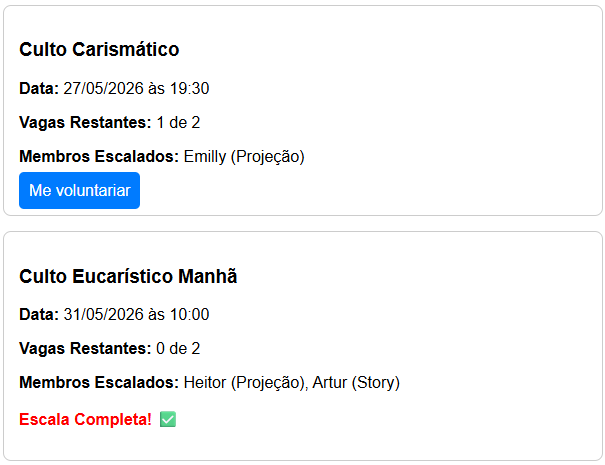

# 🎥 Escala Mídia - Igreja

> Um sistema web direto e eficiente para organizar e automatizar a escala de voluntários da equipe de mídia e comunicação da igreja.

---

## 📸 Demonstração



*Interface pública listando os cultos, vagas disponíveis, membros escalados com suas respectivas funções e alerta de lotação máxima.*

---

## 🎯 O Problema que Resolvemos

Substituir planilhas manuais e trocas de mensagens confusas por um sistema *self-service*. A liderança cadastra os cultos e eventos com limites de vagas, e os próprios membros acessam a plataforma pelo celular para sinalizar os dias e as funções em que podem servir.

---

## ✨ Principais Funcionalidades

* **Gestão Centralizada (Admin):** Criação de eventos, controle de membros e visualização rápida das escalas.
* **Inscrição Self-Service:** Interface pública simples para o voluntário escolher o evento e a sua respectiva **Função** na equipe (ex: Câmera, Mesa de Som, Transmissão).
* **Feedback Visual:** Alertas de sucesso ao se voluntariar e tratamento de erros na tela para uma melhor experiência do usuário (UX).
* **Regras de Negócio Inteligentes:**
  * Bloqueio automático ao atingir o limite máximo de voluntários por evento.
  * Prevenção de inscrições duplicadas (o mesmo membro não pode se inscrever duas vezes no mesmo culto).
  * Limite de 6 escalas por mês por voluntário.
* **Exibição Dinâmica (Time Window):** O painel de eventos exibe a escala do mês vigente. A partir do dia 25 de cada mês, o sistema faz uma transição automática e passa a exibir também os eventos do mês seguinte, facilitando o planejamento prévio da equipe.
* **Qualidade de Código:** Lint (Ruff), 24 testes automatizados, CI/CD via GitHub Actions.

---

## 🛠️ Stack Tecnológica

* **Backend:** Python 3.12+ / Django 6.0.4
* **Banco de Dados:** SQLite (local) / PostgreSQL (planejado)
* **Frontend:** HTML/CSS (Templates nativos do Django)
* **Qualidade:** Ruff (lint + format), 24 testes automatizados
* **CI/CD:** GitHub Actions (lint → test → build Docker)
* **Infraestrutura:** Docker e Docker Compose
* **Produção:** PythonAnywhere

---

## 🚀 Começando

### Pré-requisitos

- Python 3.10+ (de preferência 3.12)
- Docker e Docker Compose (opcional, para rodar com containers)

### Variáveis de Ambiente

Por padrão o projeto funciona sem configurar nada em desenvolvimento. Em produção, defina:

| Variável | O que faz | Fallback |
|----------|-----------|----------|
| `DJANGO_SECRET_KEY` | Chave criptográfica para sessões | `fallback-dev-only` |
| `DJANGO_DEBUG` | Modo debug (`True`/`False`) | `False` |
| `DJANGO_ALLOWED_HOSTS` | Domínios permitidos (separados por vírgula) | `*` |

---

## 🐳 Como rodar com Docker (Recomendado)

```bash
git clone <url-do-repositorio>
cd escala-app
docker-compose up --build -d
```

Acesse http://localhost:8080

---

## ⚙️ Como rodar localmente (Sem Docker)

```bash
# 1. Crie e ative o ambiente virtual
python3 -m venv venv
source venv/bin/activate
# Windows: .\venv\Scripts\activate

# 2. Instale as dependências
pip install -r requirements.txt

# 3. Aplique as migrações
python manage.py migrate

# 4. Rode o servidor (--insecure para servir estáticos com DEBUG=False)
python manage.py runserver --insecure 8080
```

Acesse http://127.0.0.1:8080/

---

## 🧪 Testes

```bash
python manage.py test --verbosity=2
```

São **24 testes** automatizados divididos em:

| Categoria | Arquivo | Testes |
|-----------|---------|--------|
| Models | `escala/tests/test_models.py` | 8 |
| Views | `escala/tests/test_views.py` | 12 |
| Forms | `escala/tests/test_forms.py` | 4 |

---

## 🔍 Lint e Formatação

```bash
ruff check .          # Verifica erros de código
ruff format .         # Formata automaticamente
```

---

## 🏗️ Makefile

Comandos atalho para o dia a dia:

```bash
make lint        # ruff check .
make format      # ruff format .
make test        # python manage.py test
make run         # servidor local (porta 8080)
make static      # collectstatic
make migrate     # migrate
make install     # pip install -r requirements.txt
```

---

## 🤖 CI/CD

A cada `git push` na branch `main`, o GitHub Actions executa:

1. **lint** — Ruff (check + format)
2. **test** — 24 testes do Django
3. **build** — docker build

Veja o arquivo `.github/workflows/ci.yml` para detalhes.

---

## 🌐 Deploy

O deploy segue estes passos no servidor:

```bash
git pull origin main
python manage.py migrate
python manage.py collectstatic --noinput
# Recarregar a aplicacao no servidor
```

**Importante:** as variáveis de ambiente (`DJANGO_SECRET_KEY`, `DJANGO_DEBUG`, `DJANGO_ALLOWED_HOSTS`) precisam estar configuradas no ambiente do servidor.

---

## 🗺️ Roadmap

### Concluído

- [x] Modelagem de Banco de Dados (Eventos, Membros, Escalas)
- [x] Regra de limite de vagas e prevenção de duplicidade
- [x] Limite de 6 escalas por mês por voluntário
- [x] Tela pública de voluntariado com seleção de funções
- [x] Lógica de exibição com janela de transição mensal
- [x] Melhorias na interface UX/UI (mensagens de sucesso e erro)
- [x] Conteinerização do projeto (Docker / docker-compose)
- [x] Deploy do MVP em ambiente Cloud (PythonAnywhere)
- [x] Lint e formatação automática (Ruff)
- [x] 24 testes automatizados (models, views, forms)
- [x] Pipeline CI/CD (GitHub Actions)
- [x] Segurança (SECRET_KEY/DEBUG/ALLOWED_HOSTS por env vars)

### Futuro

- [ ] Migração do banco para PostgreSQL
- [ ] Deploy automatizado via GitHub Actions → PythonAnywhere
- [ ] Type checking com mypy
- [ ] Autenticação de membros (login próprio, não só admin)